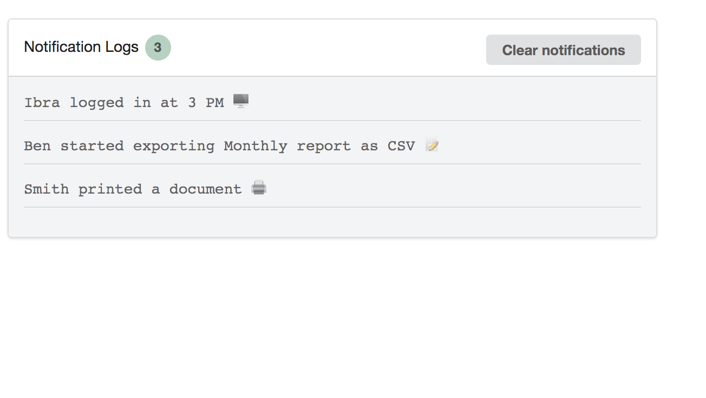

# react-flexi-image-grid
React js Flexible Image Grid View

<h2>How to install ?</h2> 
<pre>
yarn add react-event-list
</pre>

<h2>Example:</h2>



<h1>How to use it ? </h1>

```

import React, {Component} from "react";
import {EventLogList} from "react-event-list";


class App extends Component {
    render() {
        return (
            <div className="App">

                <div style={{width: "600px", marginLeft: "10px", marginTop: "20px"}}>


                    <EventLogList
                        title={"Notification Logs"}
                        logs={[
                            "Ibra logged in at 3 PM ",
                            "Ben started exporting Monthly report as CSV ,
                            "Smith printed a document  ",
                        ]}
                        clearBtnText={"Clear notifications"}
                    />
                </div>
            </div>
        );
    }
}

export default App;


```
